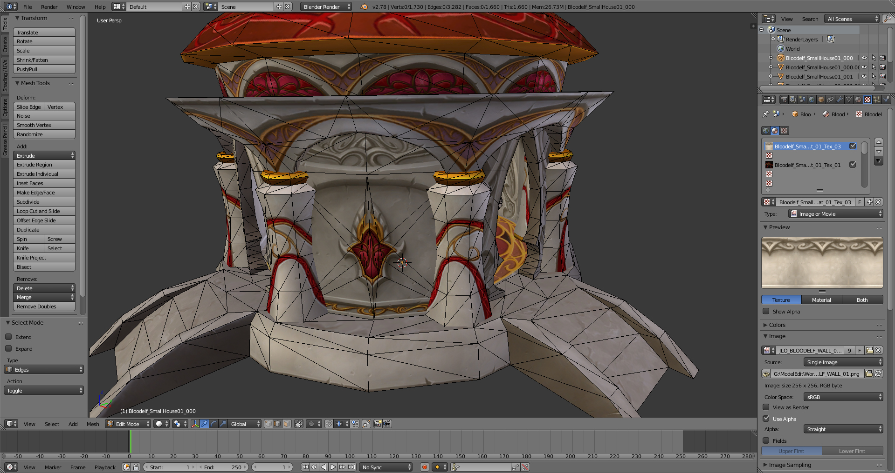
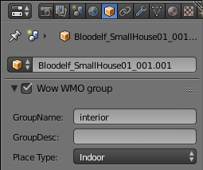
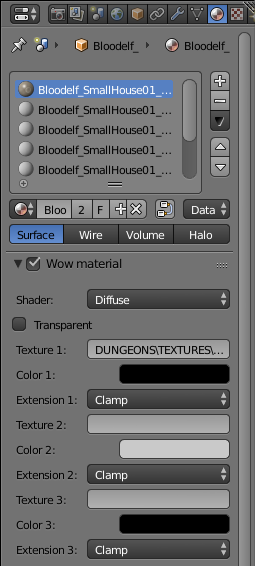
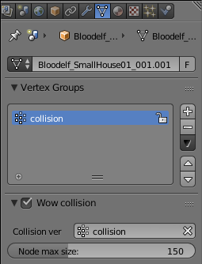
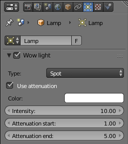

# WMO Addon for Blender 2.5

This is an addon for Blender 2.5+, that allows import/export of World of warcraft's WMO files (v3.3.5).

### About the code
This addon is entirely written in python.
As for the solution file, this is a vs2017 project that requires Python tools. Don't worry if you don't have it installed, you can still edit the code. Nothing more than the .py files in the main folder are actually required.

### Installation
Just install it the same way its done with every blender addon.
First go to your blender installation directory (by default &lt;ProgramFiles&gt;\Blender Foundation\Blender\ &lt;version&gt;\scripts\addons\).
There create a folder named "io_scene_wmo" then put inside all .py files from the WMO_Blender_2_5 folder in this repository.
Then you start blender, go to User Preferences => Addons => Imort-Export => check "Wow WMO format". Done.

### Documentation
Not all features are supported yet, mostly because the format is obviously undocumented (and some piece of data seemed unused), but also because some features are not supported by blender at the time of the project (eg. normal editing is not supported by blender). But most usefull features are present and exported files are fully functionals.
At the time I wrote this addon, it was one of the only softwares that supported creation of WMO with collisions.

The addon works as follow : 

There is 4 new panels available.
Each one contains settings used during export.

<b>Wow WMO group</b> panel is in Object properties, it shows options relative to wmo groups.
Group name/desc are optionnal and are just referenced from inside wmo, seems to have no effect. 
This panel MUST be enabled when exporting, else export will fail.
      

<b>Wow material</b> panel is in Material properties, it shows options relative to wmo shader. The only options that are exported are shown in this panel (blender materials / texture are not exported)
Materials are displayed on faces assigned to this material. 
If the panel is disabled, the material is not exported and assigned faces will not be visible in game (it can still collide though)
     

<b>Wow collision</b> panel is in Data properties and are only visible when selecting a mesh. It shows options relative to wmo collisions. "collision vertex group" specifies the vertex group whose faces will be allowed to collide.
          

<b>Wow light</b> panel is in Data properties and are only visible when selecting a lamp. It shows options relative to wmo lights. This panel will probably change later.
Lights are not exported for now.
           

<b>UV</b> 
Only the active UV layer is exported. UV data imported are stored in "UVmap" layer.

<b>Vertex color</b> 
Only the active Vertex Color layer is exported. Vertex color data imported are stored in "Col" layer.
